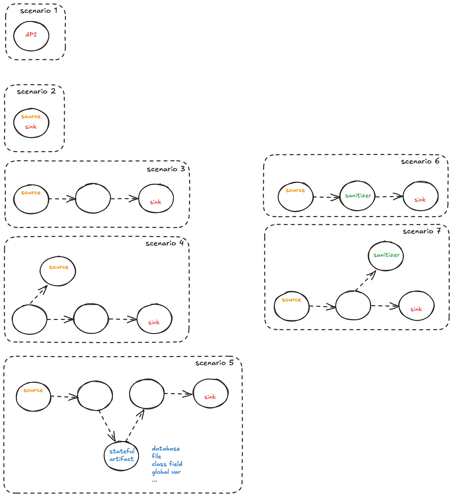

# Story for the demo

- _(before)_ run our beta SAST solution
  - little number of findings
  - what can we achieve by improving rules?
  - for sure no inter-procedural _(double-check)_
  - ...

- _(after)_ run our pre-alpha SAST AI-boosted solution 
  - less FNs, less FPs
  - managing complex (dataflow) scenarios

- Open questions / limitations:
  - scalability? function summaries
  - validation of AI results? 
    - for dataflow results:
      - automatically generated unit-tests via AI
      - codeql / semgrep / others ?
      - manual validation
    - for FPs/FNs reduction: use and extend our benchmarking work
    - dataflow:
      - deep source/sinks embedding in functions
  

## Extensions: complexity-increasing SAST scenarios
Extend the demo application to include the following scenarios.

| # | Title | Demo | Theory | Test | 
|----------|-------|------|---------|---------|
| 1 | API | ✓ | ✓ | ? |
| 2 | Source/sink in the same function | ✓ |  ✓ | ? |
| 3 | Source/sink in a direct callpath | ✓ | ✓ |
| 4 | Source/sink in an indirect callpath | ✓ | ~  | ? |
| 5 | Source/sink in two callpaths | ✓ | ~ | ? |
| 6 | Sanitizer directly called | ✓ | ✓ | ? |
| 7 | Sanitizer indirectly called | ✓ | ~ | ? |

### Scenario 1 - API
The two cases below show how to reduce FPs without hampering FNs.
- **description**: a dangerous API is used, but whether it is hampering security depends on the context in which that API is used
- **example**: obsolete random-number generator. Dangerous if used for crypto operations or for operation where unguessability is required. Not problematic if used for security unrelated operation.

#### Case 1 : FP reduction
- **example-continuation**:  random color to be associated to a text
- **demo**: 
  - The `store_text_with_colors` function in `./flask_webgoat/user_resources.py` uses the non-cryptographic `random` library for generating color to be associated with text
  - Steps to reproduce:
    1. Log in to the application
    2. Use the `/api/store_text_with_colors` endpoint to save some text
    3. The application uses `random.randint()` to generate the color to be associated to the text
    4. This is acceptable for randomly generating a color, but would be insecure for security-sensitive operations

#### Case 2 : no hampering FNs

- **example-continuation**: file name generation may require unguessability
- **demo**: 
  - The `store_text` function in `./flask_webgoat/user_resources.py` uses the non-cryptographic `random` library for generating filenames
  - Steps to reproduce:
    1. Log in to the application
    2. Use the `/api/store_text_with_colors` endpoint to save some text
    3. The application uses `random.randint()` to generate the filename suffix
    4. This may not be acceptable for general filename generation as filenames could be guessed
    5. Here is where the end-user should say "no, this is not secure enough" and we could persist this feedback for future evaluation

### Scenario 2 - source/sink in the same function

- **description**: source/sink in the same function, intra-procedural SAST sufficient. The vulnerability exists within a single function, where user input is directly used in a dangerous operation without proper validation.
- **example**: Open redirect vulnerability where a URL parameter from the request is directly used in a redirect function without validation.
- **demo**:
  - open redirect: `login_and_redirect` in `./flask_webgoat/auth.py`
  - The function takes a URL parameter and uses it directly in a redirect without validating if it's a safe destination.
  - Steps to reproduce:
    1. Access the login_and_redirect endpoint with invalid credentials and a malicious URL
    2. Observe that the application redirects to the arbitrary URL

### Scenario 3 - source/sink in a direct callpath, but in different functions

- **description**: The vulnerability involves a direct flow of data between two functions, where one function execute a user input operation (source) and directly passes it to another function that performs (directly or indirectly) a dangerous operation (sink). This requires inter-procedural analysis to detect.
- **example**: SQL injection vulnerability where a user-provided parameter is passed directly from a route handler to a custom function performing the database query.
- **demo**: 
  - SQL injection: The `login` function in `./flask_webgoat/auth.py` uses string formatting to build a SQL query with user input
  - That input is then provided to the `db_query` function that in turns execute the query to the database
  - Steps to reproduce:
    1. Attempt to login with a specially crafted username like `admin' --`
    2. The application will directly pass this to the SQL query, bypassing password validation

### Scenario 4 - source/sink in an indirect callpath

- **description**: A callpath exists between a function with a dangerous operation (sink) and another one that is indirectly consuming a user input. Here the user input is not collected directly by a function but indirectly via some intermediate functions. 
- **example**: A user input is processed by an intermediary function that extracts and processes data before the processed result is used in a dangerous way without proper sanitization.
- **demo**: 
  - XSS vulnerability in the `search` function in `./flask_webgoat/ui.py` that uses `get_invalid_parameters` helper function
  - Steps to reproduce:
    1. Send a request to the /search endpoint with valid 'query' parameter plus additional malicious parameters
    2. The `get_invalid_parameters` function collects all parameters except 'query'
    3. These parameter values are directly incorporated into the response without sanitization
    4. Example attack URL: `http://127.0.0.1:5000/search?query=admin&whatever=`

### Scenario 5 - source/sink in two callpaths (2nd order vulns)

- **description**: Second-order vulnerabilities where malicious data is stored in one request and then retrieved and used in a dangerous way in a subsequent request. These are particularly difficult to detect as they require tracking data across multiple operations.
- **example**: Stored XSS where user input is first saved to a database and later retrieved and displayed to users without proper escaping.
- **demo**: 
  - Stored XSS in the `create_user` and `welcome` endpoints:
  - Steps to reproduce:
    1. Login as admin
    2. Create a new user with a malicious script in the nickname field using the `create_user` endpoint in `./flask_webgoat/users.py`
    3. Login as the new user
    4. Access the `welcome` endpoint in `./flask_webgoat/ui.py` which retrieves and displays the nickname without proper escaping

### Scenario 6 - sanitizer directly called in the source/sink callpath

- **description**: A security control is in place where user input is properly sanitized or validated before being used in a potentially dangerous operation. This sanitization happens directly in the execution path.
- **example**: Using parameterized queries for database operations instead of string concatenation, which prevents SQL injection.
- **demo**: 
  - Properly prepared SQL query: `login_and_redirect` in `./flask_webgoat/auth.py` uses parameterized query with `?` placeholders
  - Steps to reproduce:
    1. Attempt SQL injection with the same payload that worked in the vulnerable `login` function
    2. Observe that the attack fails because the input is properly sanitized through parameterization

### Scenario 7 - sanitizer indirectly called in the source/sink callpath

- **description**: A security control is applied through an indirect call path, where user input is validated or sanitized by an intermediate function before reaching a potentially dangerous operation.
- **example**: URL validation through a reusable validation function that's called before performing redirects, preventing open redirect vulnerabilities across multiple routes.
- **demo**: 
  - Open redirect prevention: The `login_and_redirect_safely` route in `./flask_webgoat/auth.py` uses the `is_safe_url()` helper function
  - Steps to reproduce:
    1. The route receives a URL parameter from the user's request
    2. Before redirecting, it calls the separate `is_safe_url()` function that validates the URL
    3. The `is_safe_url()` function checks if the URL is relative or points to a trusted domain
    4. Only if the URL passes validation, the redirect operation is performed
    5. Try accessing `/login_and_redirect_safely` with valid credentials but a malicious URL and observe it being blocked

## Todos

- Call graph related
  - [x] sources embedded in a function call
    - done in the XSS examples in `./flask_webgoat/ui.py`
  - [x] sinks embedded in a function call
    - done in the SQLi examples in `./flask_webgoat/auth.py`

- FPs reduction
  - [ ] sanitizers
  - [ ] trusted inputs
  - [ ] random-number generation for not-security-relevant usages

- FNs reduction
  - [x] stored XSS: 
    - login as admin
    - create a new user adding JS in the nickname field
    - login with the new user 
    - new user access the welcome endpoint and JS is executed 
  - [x] inter-procedural case 
    - multiple places, e.g., SQLi examples in `./flask_webgoat/auth.py`
  
- Context related, could reduce both FNs/FPs  
  - [ ] dynamic code to execute some SQL statement